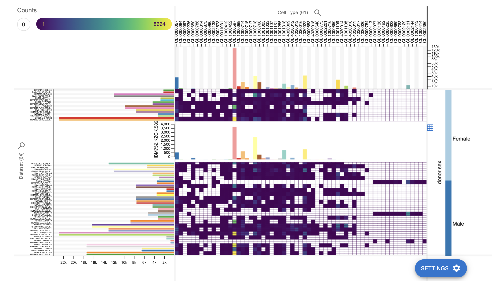

# scellop: Cell Type Composition Explorer
Scellop (previously CellPop) is an interactive visualization tool for cell type compositions. Easily compare your cell type compositions with different visual encodings, filter and sort on metadata, and export for communication.


## Why scellop? 
Cell type populations are commonly shown with stacked bar charts. However, scaling the number of samples and cell types in these visualizations create issues with analyzing these charts. CellPop alleviates this by presenting a flexible heatmap and side views with extending layered bar charts.


## Installs
Scellop is available on [NPM](https://www.npmjs.com/package/cellpop) and [PyPI](https://pypi.org/project/cellpop/).


```sh
npm i cellpop
```

```sh
pip install cellpop
```

## Demo
A demo is available [here](https://scellop.netlify.app). How to use the CellPopComponent is shown [here](./demo/demo.tsx).

The main view and interactions:



## Set-up
This project uses pnpm. 

Install dependencies with:
```sh
pnpm install
```

Run the demo with:
```sh
pnpm run dev
```

Instructions for Python package are it's own [contributing guidelines](./python/CONTRIBUTING.md).


## Team
[HIDIVE Lab](https://hidivelab.org)
- Thomas C. Smits (<tsmits@hms.harvard.edu>)
- Nikolay Akhmetov (<nikolay_akhmetov@hms.harvard.edu>)
- Tiffany Liaw (<tiffany_liaw@hms.harvard.edu>)
- Nils Gehlenborg (<nils@hms.harvard.edu>)
