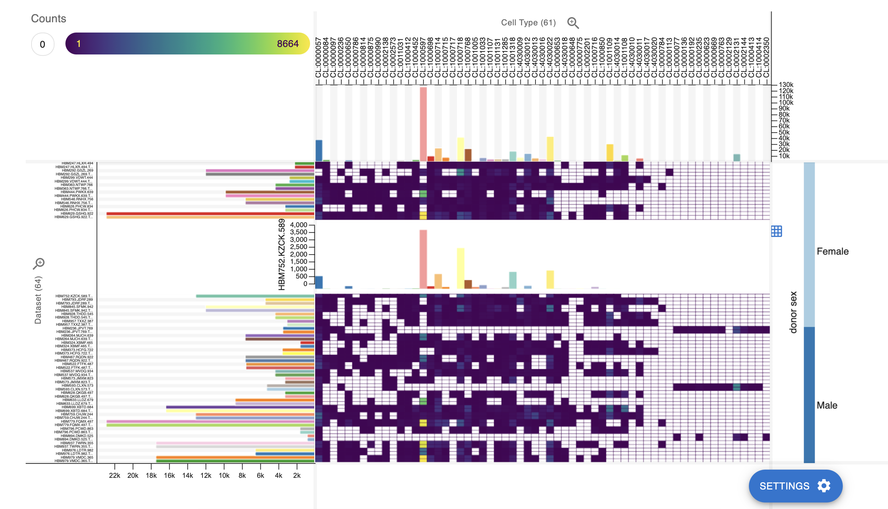

# scellop: Cell Type Composition Explorer
Scellop (previously CellPop) is an interactive visualization tool for cell type compositions. Easily compare your cell type compositions with different visual encodings, filter and sort on metadata, and export for communication.


## Why scellop? 
Cell type populations are commonly shown with stacked bar charts. However, scaling the number of samples and cell types in these visualizations create issues with analyzing these charts. Scellop alleviates this by presenting a flexible heatmap and side views with extending layered bar charts.


## Installs
Scellop is available on [NPM](https://www.npmjs.com/package/scellop) and [PyPI](https://pypi.org/project/scellop/).

```sh
npm i scellop
```

If you load data from the HuBMAP portal, also install the HuBMAP loader:

```sh
npm i @scellop/hubmap-data-loading
```

```sh
pip install scellop
```

## Demo
A demo is available [here](https://scellop.netlify.app). How to use the ScellopComponent is shown [here](./sites/demo/src/demo.tsx).

The main view and interactions:



## Repository layout
This is a pnpm workspace monorepo.

| Path | Package | Published |
| --- | --- | --- |
| `packages/scellop` | `scellop` | NPM |
| `packages/data-loading` | `@scellop/data-loading` | NPM |
| `packages/hubmap-data-loading` | `@scellop/hubmap-data-loading` | NPM |
| `sites/demo` | `@scellop/demo` | no (deployed to Netlify) |
| `python` | `scellop` | PyPI |


## Set-up
This project uses pnpm.

Install dependencies with:
```sh
pnpm install
```

Run the demo with:
```sh
pnpm run dev
```

Other workspace-wide commands:
```sh
pnpm build       # build every package
pnpm test:run    # run all tests once
pnpm typecheck   # tsc --noEmit across packages
pnpm lint:fix    # Biome, auto-fix
pnpm bench       # performance benchmarks
```

Releases are managed with [changesets](https://github.com/changesets/changesets). Add one with `pnpm changeset` in any PR that changes a published package.

Instructions for Python package are it's own [contributing guidelines](./python/CONTRIBUTING.md).


## Team
[HIDIVE Lab](https://hidivelab.org)
- Thomas C. Smits (<tsmits@hms.harvard.edu>)
- Nikolay Akhmetov (<nikolay_akhmetov@hms.harvard.edu>)
- Tiffany Liaw (<tiffany_liaw@hms.harvard.edu>)
- Nils Gehlenborg (<nils@hms.harvard.edu>)

## Paper
Our preprint is available [here](https://arxiv.org/abs/2510.09554).

Please cite this work as follows:

```
Thomas C Smits, Nikolay Akhmetov, Tiffany S. Liaw, Mark S. Keller, Eric Moerth, Nils Gehlenborg (2025). scellop: A Scalable Redesign of Cell Population Plots for Single-Cell Data. arXiv preprint. https://10.48550/arXiv.2510.09554
```
